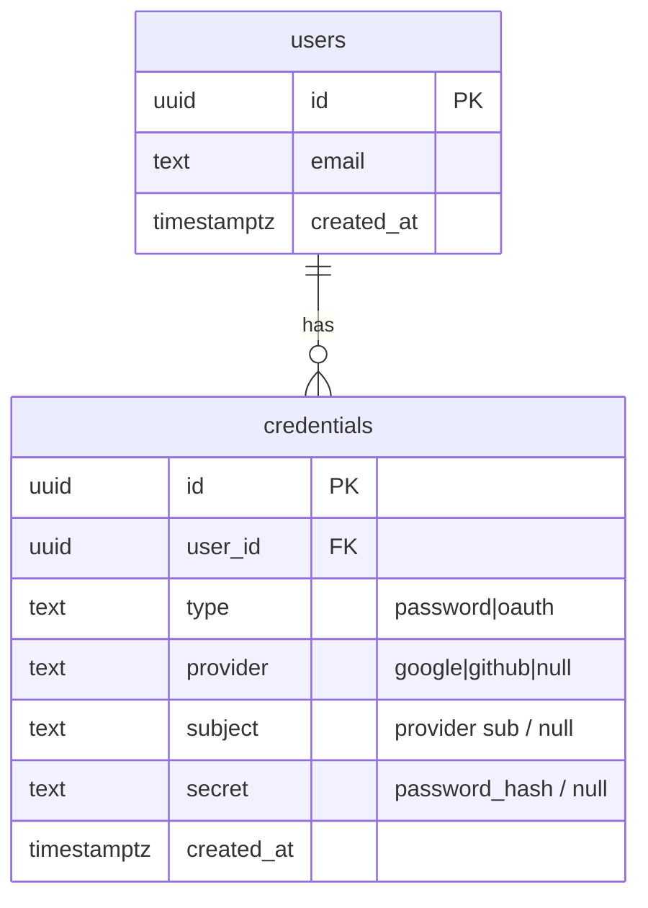

# Supporting future credential types: SSO

Design walkthrough of the current auth data model and API, and what adding SSO
(OAuth/OIDC) would require at the schema and API layer. Grounded in the current
code (onion architecture: `internal/app`, `internal/adapters`, `internal/transport/http`).

## Framing

The current model is **password-first**, not credential-agnostic. Some decisions
make adding SSO easier; others get in the way.

### What already points in the right direction

- **The token boundary is credential-agnostic.** `TokenIssuer.Issue` takes a
  `domain.User`, not a password or credentials (`internal/app/ports.go`). An
  OAuth login terminates in the same final step password login already uses:
  "this is the verified user, mint a token" (`s.tokens.Issue(ctx, user)` in
  `internal/app/accounts.go`). That step needs zero changes.
- **Generic domain errors.** `ErrInvalidCredentials` is not `ErrWrongPassword`
  (`internal/domain/errors.go`), so a failed OAuth exchange can map to the same
  uniform "denied" without new vocabulary.

### What blocks SSO today

- **The credential is fused into the user.** `PasswordHash` is a column on
  `domain.User` (`internal/domain/user.go`). This models "a user *is* a password
  account," but SSO is 1:N - one user may have a password *and* a Google login,
  or be pure-SSO with no password at all.
- **The repository forces a password at creation.** `Create(ctx, email, passwordHash)`
  and its SQL hard-code the password (`internal/adapters/postgres/user_repo.go`).
  An SSO-first signup has no password to pass.
- **The API surface is password-shaped.** Both endpoints accept exactly
  `{email, password}`, and `DisallowUnknownFields()` rejects anything else
  (`internal/transport/http/auth_handler.go`). `/login` cannot carry an OAuth
  `code`. SSO needs new routes, not new fields - which is fine, because OAuth is
  a redirect dance, not a single JSON POST.

## Target shape: split identity from credentials

- `users` loses `password_hash` and becomes pure identity.
- A new `credentials` table holds one row per auth method. For SSO:
  `type='oauth'`, `provider='google'`, `subject=<OIDC sub>`, `secret=NULL`
  (the IdP holds the secret).
- `TokenIssuer` stays exactly as-is. Everything downstream of "we have a verified
  `domain.User`" is untouched.



## Rough outline of model and schema changes

Structure and signatures only - not full logic.

### 1. Database schema

`users` - drop the credential column, keep it pure identity:

```sql
-- migration: 0002_split_credentials.up.sql
CREATE TABLE users (
    id          UUID PRIMARY KEY DEFAULT gen_random_uuid(),
    email       TEXT UNIQUE NOT NULL,
    created_at  TIMESTAMPTZ NOT NULL DEFAULT now()
);
-- password_hash moves OUT of users
```

`credentials` - new table, one row per auth method:

```sql
CREATE TABLE credentials (
    id          UUID PRIMARY KEY DEFAULT gen_random_uuid(),
    user_id     UUID NOT NULL REFERENCES users(id) ON DELETE CASCADE,
    type        TEXT NOT NULL,              -- 'password' | 'oauth'
    provider    TEXT,                       -- 'google' | 'github' | NULL for password
    subject     TEXT,                       -- OIDC 'sub' | NULL for password
    secret      TEXT,                       -- password_hash | NULL for oauth
    created_at  TIMESTAMPTZ NOT NULL DEFAULT now()
);

-- one password per user
CREATE UNIQUE INDEX ux_cred_password
    ON credentials (user_id) WHERE type = 'password';

-- an external identity maps to exactly one credential
CREATE UNIQUE INDEX ux_cred_oauth
    ON credentials (provider, subject) WHERE type = 'oauth';
```

### 2. Domain models (`internal/domain`)

```go
type User struct {
    ID        string
    Email     string
    CreatedAt time.Time
    // PasswordHash removed
}

type Credential struct {
    ID        string
    UserID    string
    Type      string // "password" | "oauth"
    Provider  string // "" for password
    Subject   string // "" for password
    Secret    string // password hash for password, "" for oauth
    CreatedAt time.Time
}
```

New error for the linking path, e.g. `ErrCredentialNotFound`.

### 3. App layer ports (`internal/app/ports.go`)

```go
type UserRepository interface {
    Create(ctx context.Context, email string) (domain.User, error) // no passwordHash
    FindByEmail(ctx context.Context, email string) (domain.User, error)
    FindByID(ctx context.Context, id string) (domain.User, error)
}

type CredentialRepository interface {
    Add(ctx context.Context, c domain.Credential) error
    FindPassword(ctx context.Context, userID string) (domain.Credential, error)
    FindByOAuth(ctx context.Context, provider, subject string) (domain.Credential, error)
}

// New port for the IdP exchange (adapter under internal/adapters/security)
type OAuthProvider interface {
    AuthURL(state string) string
    Exchange(ctx context.Context, code string) (OAuthIdentity, error)
}

type OAuthIdentity struct {
    Provider      string
    Subject       string
    Email         string
    EmailVerified bool
}

// TokenIssuer unchanged
```

### 4. Service surface (`internal/app/accounts.go`)

Rough signatures only - existing methods adjust to use the two repos; one new
method for SSO:

```go
// password signup: create user, then Add a password credential
func (s *Service) SignUp(ctx, Credentials) (domain.User, error)

// password login: FindByEmail -> CredentialRepo.FindPassword -> Compare -> Issue
func (s *Service) SignIn(ctx, Credentials) (SignInResult, error)

// NEW: callback path
//  1. provider.Exchange(code) -> OAuthIdentity
//  2. CredentialRepo.FindByOAuth(provider, subject)
//       hit  -> load user
//       miss -> find-or-create user by verified email, Add oauth credential
//  3. tokens.Issue(user)  // unchanged
func (s *Service) SignInWithOAuth(ctx, provider, code, state string) (SignInResult, error)
```

### 5. Transport (`internal/transport/http`)

Two new routes (no field changes to `/signup` or `/login`):

```go
mux.HandleFunc("/auth/oauth/{provider}/start", handler.oauthStart)      // 302 -> IdP, set state cookie
mux.HandleFunc("/auth/oauth/{provider}/callback", handler.oauthCallback) // verify state, call SignInWithOAuth
```

## Account-linking policy (a real security decision)

Does a Google login with a matching email link to an existing password user, or
stay separate? Auto-linking on an *unverified* email is an account-takeover
vector - link only when the IdP reports `email_verified`.

## Migration ordering (so passwords never break)

1. Create `credentials`, backfill existing `users.password_hash` into
   `credentials (type='password')`.
2. Ship repo/service changes reading the password from `credentials` while the
   old column still exists.
3. Drop `users.password_hash` in a later migration once nothing reads it.

## Bottom line

The token/session boundary is already credential-agnostic, so the SSO work is
almost entirely in the *front half*: extract `PasswordHash` out of `User` into a
polymorphic `credentials` table, let `UserRepository.Create` make users without a
password, add an `OAuthProvider` port, and add `start`/`callback` routes instead
of overloading `{email, password}`.
